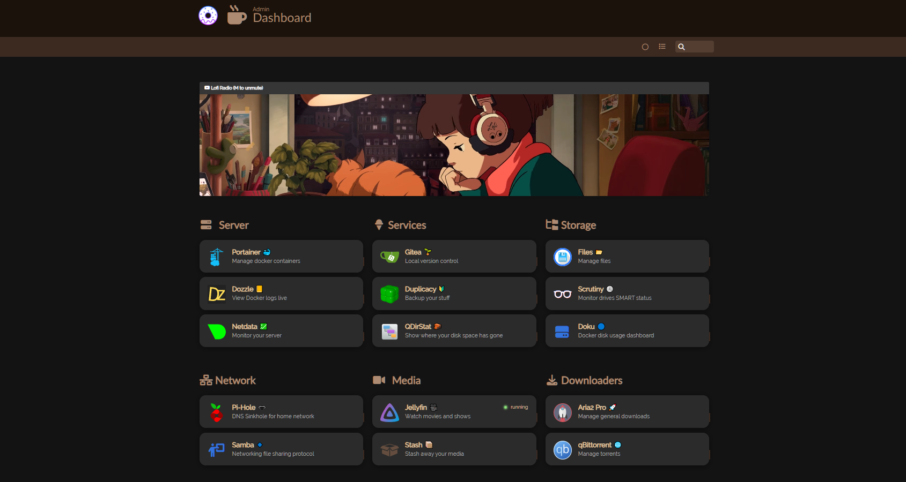

# **🛖 Home Server**
Contains my config files, docker compose files, and documentation for setting up my home server. All hosted on one single Raspberry Pi and one 4TB SSD!



## 📃 Index 
<!--ts-->
   * 📔 Docs 
      * [Preparing Raspberry Pi OS (Bookworm)](docs/1_Raspberry%20Pi%20OS%20Image%20Configuration.md) 🐛
        * [SATA SSD Setup](docs/SSD/SATA%20SSD%20Setup.md)
      * [OS Configuration](docs/2_OS%20Configuration.md)
      * [Portainer Setup](docs/3_Portainer%20Setup.md)
        * 📚 Stacks  
          * [Homer](stack/current/homer.yml)
          * [File Browser](stack/current/filebrowser.yml) <!-- Could be better -->
          * [JellyFin](stack/current/jellyfin.yml)
          * [Aria2 Pro](stack/current/aria2-pro.yml)
          * [Scrutiny](stack/current/scrutiny.yml)
          * [Netdata](stack/current/netdata.yml) <!-- Will force a cloud requirement! -->
          * [Dozzle](stack/current/dozzle.yml)
          * [WireGuard-Easy](stack/current/wg-easy.yml)
          * [qBittorrent](stack/current/qbittorrent.yml)
          * [Gitea](stack/current/gitea.yml)
          * [Stash](stack/current/stash.yml)
          * [LanguageTool](stack/current/languagetool.yml) <!-- Version 8.13.2 of the Firefox add-on -->
          * [Syncthing](stack/current/syncthing.yml)
          * [QDirStat](stack/current/qdirstat.yml)
          * [Doku](stack/current/doku.yml)
          * [Jellyseerr](stack/current/jellyseerr.yml) <!-- Would perfer an alternative -->
          * [Samba](stack/current/samba.yml)
          * [LANraragi](stack/current/lanraragi.yml)
          * [Calibre Web Automated](stack/current/calibre-web-automated.yml)
          * [Memos](stack/current/memos.yml)
          * [Immich](stack/current/immich.yml)
          * [Kiwix-Serve](stack/current/kiwix-serve.yml)
          * [Snippet Box](stack/current/snippet-box.yml) <!-- Need alternative, unmaintained, CVE-2023-23277 -->
        * ❌ Retired Services 
          * [Duplicacy](stack/retired/duplicacy.yml)
          * [Kavita](stack/retired/kavita.yml)
          * [Pi-hole](stack/retired/pi-hole-vanilla.yml) <!-- Dont really use it, ublock on firefox, no smart devices, etc-->
          * [ByteStash](stack/retired/bytestash.yml) <!-- Kinda worse than snippet-box at the moment-->
          * [IT-Tools](stack/retired/it-tools.yml) <!-- Don't find myself using it -->
          * [Tube Archivist](stack/retired/tube-archivist.yml) <!-- RAM intensive, would like an alternative, otherwise use Stash -->
          * [Watchtower](stack/retired/watchtower.yml) <!-- Update manually now for reliability now -->
          * [Pi.Alert](stack/retired/pi.alert.yml) <!-- Alternative fork available -->
          * [Dashdot](stack/retired/dashdot.yml) <!-- Quite CPU intensive -->
          * [Komga](stack/retired/komga.yml) <!-- Not much better than Kavita, everything other than *.cbz files is slow -->
      * [Config Files](root)
      * 🚘 Hardware
        * [Parts List](docs/HARDWARE/Parts%20List.md)
        * 🗒 SSD Notes
          * [Storage Considerations](docs/SSD/Storage%20Considerations.md)
              * [Storage Plan](docs/SSD/Storage%20Plan.md)
          * [SATA Adapter Nonsense](docs/SSD/SATA%20Adapter%20Nonsense.md)      
<!--te-->
## 🪂 Deployment

I'm currently running with Bookworm on a Pi 4 for the last year with a 4TB Samsung drive. I have deployed this same setup on Bullseye for around 9 months, no noticeable issues with a 1TB Kingston drive, also running on the Pi 4. The Samsung drive requires some initial setup to get it fully up and running, documented in this repository. Nevertheless, I am not an expert, use this entire reference at your own risk. I don't always show or follow best practices. Some information may be out of date. I have updated this reference lightly for initial setup with Bookworm. This repository is mainly for me, but you may find it useful.

## 🌴 Tree Map

```ruby
📁 /srv/stacks
├── 📁 aria2-pro
│   ├── 📁 config
│   └── 📁 downloads
├── 📁 calibre-web-automated
│   ├── 📁 calibre-library
│   ├── 📁 config
│   └── 📁 cwa-book-ingest
├── 📁 file-browser
│   ├── 📁 branding
│   └── 📁 filebrowser.db
├── 📁 gitea
│   └── 📁 data
├── 📁 homer
├── 📁 immich
│   ├── 📁 library
│   └── 📁 postgres
├── 📁 jellyfin
│   ├── 📁 config
│   └── 📁 media
│       ├── 📁 anime:ro
│       ├── 📁 movies:ro
│       ├── 📁 music:ro
│       ├── 📁 restricted:ro
│       └── 📁 shows:ro
├── 📁 jellyseerr
├── 📁 kiwix-serve
│   └── 📁 zim
├── 📁 lanraragi
│   └── 📁 content
├── 📁 memos
├── 📁 netdata
│   └── 📁 netdataconfig
├── 📁 qbittorrent
│   ├── 📁 config
│   └── 📁 downloads
├── 📁 samba
│   ├── 📁 data
│   └── 📁 Serva
├── 📁 scrutiny
│   └── 📁 config
├── 📁 snippet-box
│   └── 📁 data
├── 📁 stash
│   ├── 📁 blobs
│   ├── 📁 cache
│   ├── 📁 config
│   ├── 📁 data:ro
│   ├── 📁 generated
│   └── 📁 metadata
└── 📁 syncthing
```
