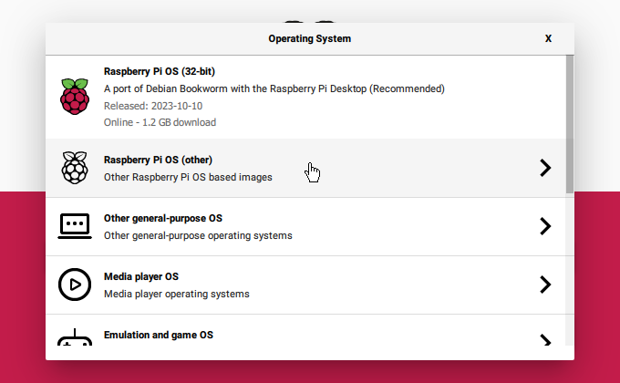
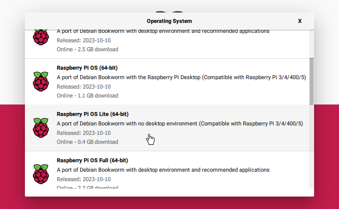
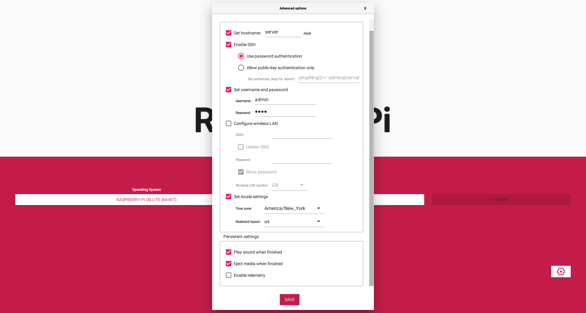
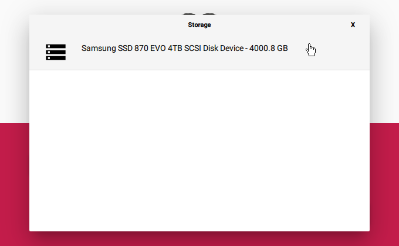

[<- index](/README.md)
# Preparing Raspberry Pi OS (Bookworm)

1. First You may want to read these:
- [Storage Considerations](/docs/SSD/Storage%20Considerations.md),
- [Storage Plan](/docs/SSD/Storage%20Plan.md),
- [SATA Adapter Nonsense](/docs/SSD/SATA%20Adapter%20Nonsense.md)

2. In *CHOOSE OS*, select `Raspberry Pi OS Other`

​
###### Version 1.7.5 of Raspberry Pi Imager was used. (1.8.1 works too)
    
3. Select `Raspberry Pi OS Lite (64-Bit) - Debian Bookworm with no desktop environment`.  

​

4. Set your hostname, username, password, locale settings, and enable SSH.

**For the rest of this guide, I am using these values:**

    **Don't Confuse yours with mine**

5. In *CHOOSE STORAGE*, click the drive you want to use.

6. Write and finish. When it is done, **Eject the drive**.

# Drives larger than 2TBs

If the drive you just flashed to is greater than 2TBs, Read the first section in [SATA SSD Setup](/docs/SSD/SATA%20SSD%20Setup.md)
