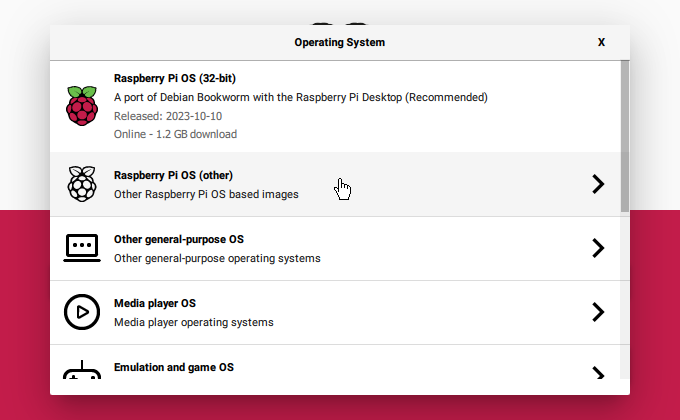
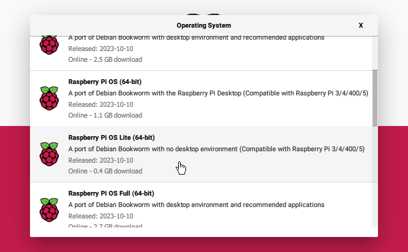
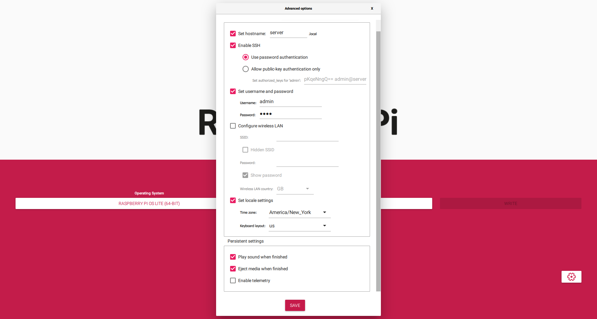
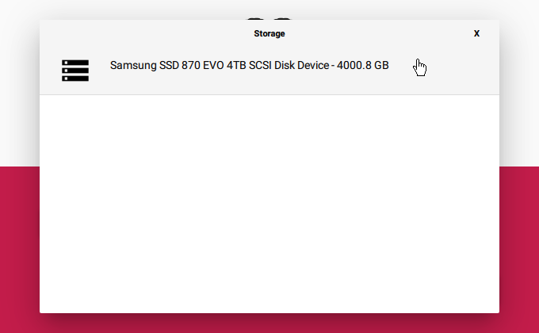

# 🍓 Raspberry Pi OS Headless Image Configuration (Bookworm)

1. Grab the latest version of Raspberry Pi Imager from [here](https://www.raspberrypi.com/software/). *Version 1.7.5 was used when I made this, some things have changed.*

2. Go in `CHOOSE OS` -> `Raspberry Pi OS Other`.

    
    
3. Select `Raspberry Pi OS Lite (64-Bit) - Debian Bookworm with no desktop environment`. 

    

4. Set your hostname, username, password, locale settings, and enable SSH.

    **For the rest of this setup, I am using these values:**

    

    **Don't Confuse yours with mine if you derail.**

5. In `CHOOSE STORAGE`, click the drive you want to use.

    

6. Write and finish. When it is done, **Eject the drive**.

# Test the Headless image 

7. Connect the storage medium and after a few minutes, SSH into the pi with the credentials you set in the imager. The pi will be assigned an ip-address, set by your router. In your router settings, you can view the table of connected devices to find the ip-address assigned to the pi. Once you have that you can simply:

    ```bash
    ssh <username>@<ip-address>
    ```
    for my values its:
    ```bash
    ssh admin@192.168.1.164
    ```


# ❗Drives that are larger than 2TBs

If the drive you just flashed to is greater than 2TBs, you won't have access to the full capacity without doing some additional steps. Read the second section in [GPT Partition Tables](/docs/SSD/SATA%20SSD%20Setup.md). This is something you need to do before moving on to configuring the os.