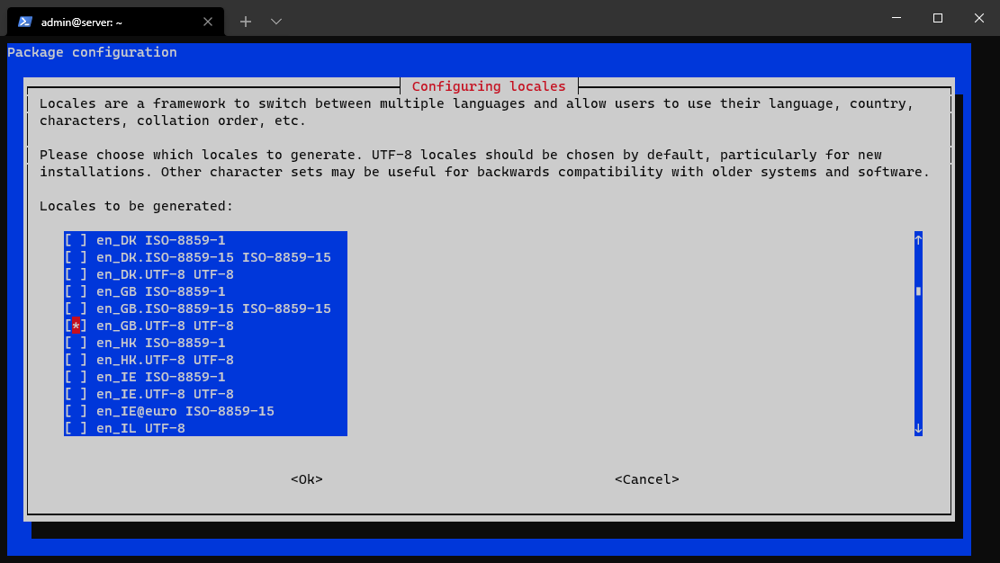
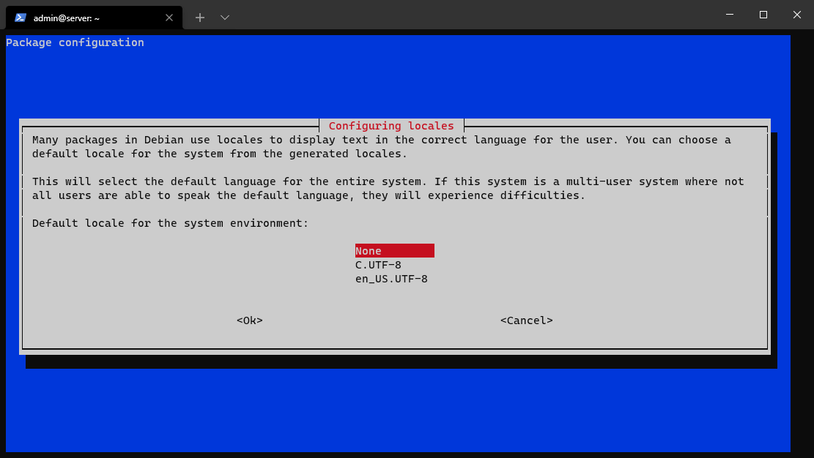
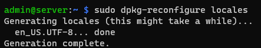
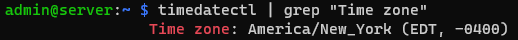
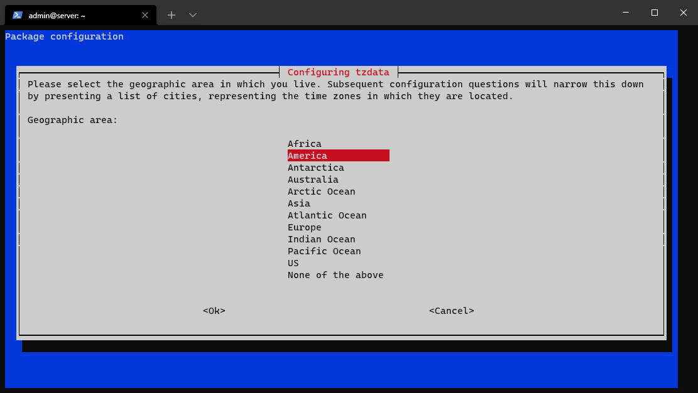
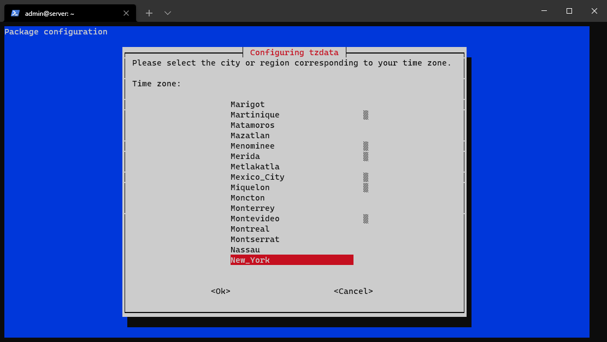
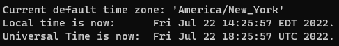
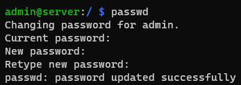
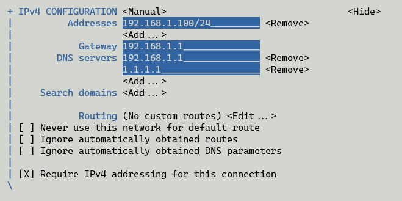

[<- index](/README.md)
# OS Configuration

SSH into the pi with the credentials you set in the imager. On Windows it is `ssh {USERNAME}@{ASSIGNED-IP-FOR-PI}`. For my values it's `ssh admin@192.168.1.164`. Where my assigned ip `192.168.1.164` is automatically set by my router. This will be different; you need to use the address to your own pi.  
  

## Locale

Change the localization from *UK* to *US*.

```bash
sudo dpkg-reconfigure locales
```

Find `en_GB.UTF-8` then unselect it with <kbd>SPACE</kbd>



Replace it with `en_US.UTF-8` using <kbd>SPACE</kbd> then press <kbd>ENTER</kbd>

​

Select `en_US.UTF-8` then press <kbd>ENTER</kbd>





## Time Zone

1. **Verify the Pi is using the correct time zone.**

     ```bash
     timedatectl | grep "Time zone"
     ```

     

2. **If it's incorrect, fix it.**

    ```bash
    sudo dpkg-reconfigure tzdata
    ``` 
    Select your time zone using <kbd>ENTER</kbd>.

    

    

    

    Then `sudo reboot`

## Update/Upgrade

Now update the Pi:

```bash
sudo apt update -y && sudo apt full-upgrade -y && sudo apt autoclean -y && sudo apt autoremove -y && sudo apt purge -y && sudo reboot
```
This might take a while.

## EEPROM
Skip unless you have a reason to update.

Check the EEPROM version:
```
sudo rpi-eeprom-update
```

If there's a new version, you can update:
```
sudo rpi-eeprom-update -a && sudo reboot
``` 

## Password

Set a good password by running `passwd`



## Sudo
Force password on sudo commands:
```bash
sudo visudo /etc/sudoers.d/010_pi-nopasswd
```

Change `admin ALL=(ALL) NOPASSWD: ALL` to `admin ALL=(ALL) PASSWD: ALL`

**The file should look something like this:**

```bash
admin ALL=(ALL) PASSWD: ALL
```

Exit and save by <kbd>CTRL+X</kbd> <kbd>Y</kbd> <kbd>ENTER</kbd>

## config.txt

Edit the `config.txt` to squeeze out some benefits:
```bash
sudo nano /boot/config.txt
```

**This is the new config:**

```bash
# For more options and information see
# http://rptl.io/configtxt
# Some settings may impact device functionality. See link above for details

# Uncomment some or all of these to enable the optional hardware interfaces
#dtparam=i2c_arm=on
#dtparam=i2s=on
#dtparam=spi=on

# Enable audio (loads snd_bcm2835)
#dtparam=audio=on

# Additional overlays and parameters are documented
# /boot/firmware/overlays/README

# Automatically load overlays for detected cameras
#camera_auto_detect=1

# Automatically load overlays for detected DSI displays
#display_auto_detect=1

# Automatically load initramfs files, if found
#auto_initramfs=1

# Enable DRM VC4 V3D driver
#dtoverlay=vc4-kms-v3d
#max_framebuffers=2

# Don't have the firmware create an initial video= setting in cmdline.txt.
# Use the kernel's default instead.
#disable_fw_kms_setup=1

# Run in 64-bit mode
#arm_64bit=1

# Disable compensation for displays with overscan
#disable_overscan=1

# Run as fast as firmware / board allows
#arm_boost=1

# ////////////////////////////////////////////////////////////////////////////////////////////
# Boot Config
dtparam=i2c_arm=off
dtparam=i2s=off
dtparam=spi=off
dtparam=audio=off
dtparam=sd_poll_once # Remove overhead of polling sd card after boot

# Skip Detection
ignore_lcd=1
camera_auto_detect=0
display_auto_detect=0
# Skip Detection

# Bookworm related
auto_initramfs=1
disable_fw_kms_setup=1
# Bookworm related

# GPU
dtoverlay=vc4-kms-v3d
max_framebuffers=2
# GPU

# CPU
#arm_boost=1
# CPU

# DO NOT CHANGE
arm_64bit=1
# DO NOT CHANGE

# Network Modules
dtoverlay=disable-bt
dtoverlay=disable-wifi
# Network Modules

# Lights
dtparam=eth_led0=4
dtparam=eth_led1=4
dtparam=act_led_trigger=none
dtparam=act_led_activelow=off
dtparam=pwr_led_trigger=none
dtparam=pwr_led_activelow=off
# Lights

# Other
disable_overscan=1
disable_splash=1
# Other

# ////////////////////////////////////////////////////////////////////////////////////////////

[cm4]
# Enable host mode on the 2711 built-in XHCI USB controller.
# This line should be removed if the legacy DWC2 controller is required
# (e.g. for USB device mode) or if USB support is not required.
otg_mode=1

[all]
```

Exit and save by <kbd>CTRL+X</kbd> <kbd>Y</kbd> <kbd>ENTER</kbd>

Then `sudo reboot`

## cmdline.txt

Run  `sudo nano /boot/cmdline.txt`

**Take note of the default:**

```bash
console=serial0,115200 console=tty1 root=PARTUUID=xxxxxxxx-xx rootfstype=ext4 fsck.repair=yes rootwait
```
What my config looks like, all on one line:

**The `root=PARTUUID` is **unique to your installation**, so keep the id the same. Just append the new args.**

```bash
console=tty1 root=PARTUUID=xxxxxxxx-xx rootfstype=ext4 fsck.repair=yes rootwait quiet logo.nologo plymouth.ignore-serial-consoles systemd.unified_cgroup_hierarchy=0 cgroup_enable=memory cgroup_memory=1
```

Exit and save by <kbd>CTRL+X</kbd> <kbd>Y</kbd> <kbd>ENTER</kbd>

Then `sudo reboot`

## nmtui

Set a static ip:
```bash
sudo nmtui
```

Select `Edit a connection` --> `Wired connection 1`

This is what I use for my static ip. Your gateway, available dns servers, and available ip ranges may be different.



Select *OK* and exit.

Then `sudo reboot`

Now ssh using the new ip.
## Processes

Minimize the idle load: 
```bash
sudo systemctl disable keyboard-setup.service && sudo systemctl disable raspi-config.service  && sudo systemctl disable dphys-swapfile.service && sudo systemctl mask triggerhappy.service && sudo systemctl mask lightdm.service && sudo systemctl mask wifi-country.service && sudo systemctl mask systemd-rfkill.service && sudo systemctl mask ModemManager.service && sudo systemctl mask hciuart.service && sudo systemctl mask cups-browsed.service && sudo systemctl mask cups.service && sudo systemctl mask bluetooth.service && sudo systemctl mask wpa_supplicant.service
```
Then `sudo reboot`

## Generating SSH Keys
1. **On the Pi**
    ```bash
    mkdir ~/.ssh && chmod 700 ~/.ssh
    ```

2. **On the host machine** 
    Create a ssh key: 
    ```bash
    ssh-keygen -t ed25519 -a 100 -C "admin@server"
    ```
    Expected output:
    ```c
    WinMachine> ssh-keygen -t ed25519 -a 100 -C "admin@server"
    Generating public/private ed25519 key pair.
    Enter file in which to save the key (C:\Users\WinMachine/.ssh/id_ed25519):
    Enter passphrase (empty for no passphrase):
    Enter same passphrase again:
    Your identification has been saved in C:\Users\WinMachine/.ssh/id_ed25519.
    Your public key has been saved in C:\Users\WinMachine/.ssh/id_ed25519.pub.
    The key fingerprint is:
    SHA256:57ImaJw4zJ2KgzMbsQMnQt7wqTKNv8WSlWrU5BToau4 admin@server
    The key's randomart image is:
    +--[ED25519 256]--+
    |   ..            |
    |  .  .           |
    | +  o            |
    |o ==..           |
    |=oo+=   S .      |
    |+X.=     o       |
    |@+*+o+  . .      |
    |*O=oB . .o       |
    |+E+=   o.        |
    +----[SHA256]-----+
    WinMachine>
    ```

3. **Send the public key to the Pi** 

    ```powershell
    scp -P 22 $env:USERPROFILE/.ssh/id_ed25519.pub admin@192.168.1.100:~/.ssh/authorized_keys
    ```
4. **SSH back into the pi and verify the keys are working** 

## sshd_config

Back on the server, harden the SSH server config:
```bash
sudo nano /etc/ssh/sshd_config
```

**Make sure you change "AllowUsers" to use your username. In my case it's *admin*.**

This is the new config:

```bash
# This is the sshd server system-wide configuration file.  See
# sshd_config(5) for more information.

# This sshd was compiled with PATH=/usr/local/bin:/usr/bin:/bin:/usr/games

# The strategy used for options in the default sshd_config shipped with
# OpenSSH is to specify options with their default value where
# possible, but leave them commented.  Uncommented options override the
# default value.

Include /etc/ssh/sshd_config.d/*.conf

#Port 22
#AddressFamily any
#ListenAddress 0.0.0.0
#ListenAddress ::

#HostKey /etc/ssh/ssh_host_rsa_key
#HostKey /etc/ssh/ssh_host_ecdsa_key
#HostKey /etc/ssh/ssh_host_ed25519_key

# Ciphers and keying
#RekeyLimit default none

# Logging
#SyslogFacility AUTH
#LogLevel INFO

# Authentication:

#LoginGraceTime 2m
#PermitRootLogin prohibit-password
#StrictModes yes
#MaxAuthTries 6
#MaxSessions 10

#PubkeyAuthentication yes

# Expect .ssh/authorized_keys2 to be disregarded by default in future.
#AuthorizedKeysFile     .ssh/authorized_keys .ssh/authorized_keys2

#AuthorizedPrincipalsFile none

#AuthorizedKeysCommand none
#AuthorizedKeysCommandUser nobody

# For this to work you will also need host keys in /etc/ssh/ssh_known_hosts
#HostbasedAuthentication no
# Change to yes if you don't trust ~/.ssh/known_hosts for
# HostbasedAuthentication
#IgnoreUserKnownHosts no
# Don't read the user's ~/.rhosts and ~/.shosts files
#IgnoreRhosts yes

# To disable tunneled clear text passwords, change to no here!
#PasswordAuthentication yes
#PermitEmptyPasswords no

# Change to yes to enable challenge-response passwords (beware issues with
# some PAM modules and threads)
KbdInteractiveAuthentication no

# Kerberos options
#KerberosAuthentication no
#KerberosOrLocalPasswd yes
#KerberosTicketCleanup yes
#KerberosGetAFSToken no

# GSSAPI options
#GSSAPIAuthentication no
#GSSAPICleanupCredentials yes
#GSSAPIStrictAcceptorCheck yes
#GSSAPIKeyExchange no

# Set this to 'yes' to enable PAM authentication, account processing,
# and session processing. If this is enabled, PAM authentication will
# be allowed through the KbdInteractiveAuthentication and
# PasswordAuthentication.  Depending on your PAM configuration,
# PAM authentication via KbdInteractiveAuthentication may bypass
# the setting of "PermitRootLogin prohibit-password".
# If you just want the PAM account and session checks to run without
# PAM authentication, then enable this but set PasswordAuthentication
# and KbdInteractiveAuthentication to 'no'.
#UsePAM yes

#AllowAgentForwarding yes
#AllowTcpForwarding yes
#GatewayPorts no
#X11Forwarding yes
#X11DisplayOffset 10
#X11UseLocalhost yes
#PermitTTY yes
#PrintMotd no
#PrintLastLog yes
#TCPKeepAlive yes
#PermitUserEnvironment no
#Compression delayed
#ClientAliveInterval 0
#ClientAliveCountMax 3
#UseDNS no
#PidFile /run/sshd.pid
#MaxStartups 10:30:100
#PermitTunnel no
#ChrootDirectory none
#VersionAddendum none

# no default banner path
#Banner none

# Allow client to pass locale environment variables
AcceptEnv LANG LC_*

# override default of no subsystems
Subsystem       sftp    /usr/lib/openssh/sftp-server

# Example of overriding settings on a per-user basis
#Match User anoncvs
#       X11Forwarding no
#       AllowTcpForwarding no
#       PermitTTY no
#       ForceCommand cvs server

# ////////////////////////////////////////////////////////////////////////////////////////////
# SSH Config
Port 5522

AddressFamily inet

Banner /etc/issue
PrintLastLog no

MaxSessions 1
Compression no

IgnoreRhosts yes
HostbasedAuthentication no

# Disabling Forwarding
AllowTcpForwarding no
AllowStreamLocalForwarding no
AllowAgentForwarding no
GatewayPorts no
PermitTunnel no
# Disabling Port Forwarding

# Login Screen
LoginGraceTime 10s
MaxAuthTries 2
# Login Screen

# Idle Timeout
ClientAliveCountMax 0
ClientAliveInterval 300
# Idle Timeout

# Password Restrictions
PasswordAuthentication no
AuthenticationMethods publickey
PermitEmptyPasswords no
UsePAM no
# Password Restrictions

# General Restrictions
PermitRootLogin no
X11Forwarding no
PermitUserEnvironment no
MaxStartups 2
# General Restrictions

# CHANGE TO YOUR USERS
AllowUsers admin
# CHANGE TO YOUR USERS

# ////////////////////////////////////////////////////////////////////////////////////////////
```

Exit and save by <kbd>CTRL+X</kbd> <kbd>Y</kbd> <kbd>ENTER</kbd>

**Test your configuration:** 
```bash
sudo /usr/sbin/sshd -t
```  
**It should return nothing, else fix your config.**

Then `sudo reboot`

Now you can SSH with the alternative port using `ssh -p 5522 admin@` followed by the IP of the server.  

## Issue banner

Change the *issue* banner:
```bash
sudo nano /etc/issue
```
  
Change it to this:  
```

    Unauthorized access to this server is prohibited.
    Legal action will be taken. Disconnect now.
    
```
Exit and save by <kbd>CTRL+X</kbd> <kbd>Y</kbd> <kbd>ENTER</kbd>

The same goes for *issue.net* banner:
```bash
sudo nano /etc/issue.net
```
  
Change it to this:  
```

    Unauthorized access to this server is prohibited.
    Legal action will be taken. Disconnect now.

``` 
Exit and save by <kbd>CTRL+X</kbd> <kbd>Y</kbd> <kbd>ENTER</kbd>

## sysctl.conf (Don't Use/Needs Testing)

Trying to edge out improved performance, security, lower network latency, and faster networking. May vary based on use case. Needs testing and is incomplete:

```bash
# ////////////////////////////////////////////////////////////////////////////////////////////
# sysctl.conf

# Default: pfifo_fast
net.core.default_qdisc=fq

# Default: cubic
net.ipv4.tcp_congestion_control=bbr

# Default: 100; Docs --> https://docs.kernel.org/admin-guide/sysctl/vm.html?highlight=vm+vfs_cache_pressure#vfs-cache-pressure
#vm.vfs_cache_pressure=75

# ////////////////////////////////////////////////////////////////////////////////////////////
```
