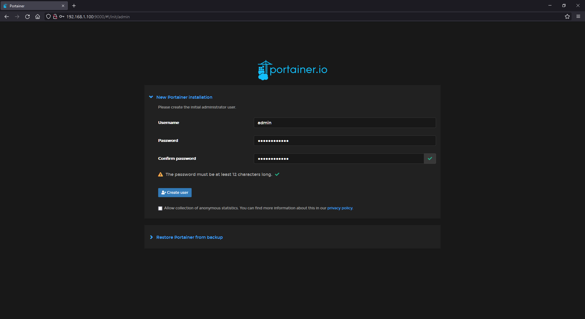
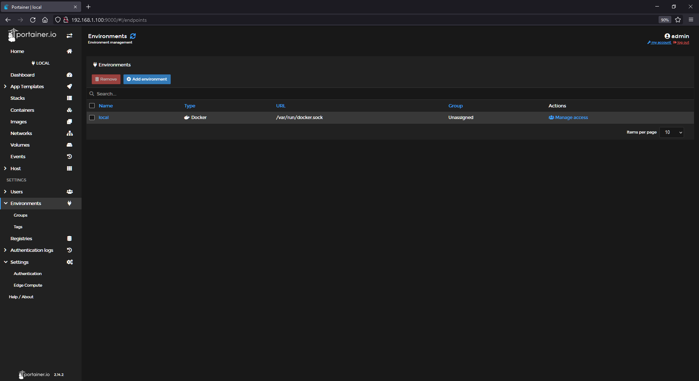
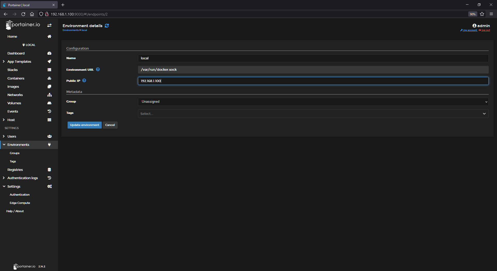

[<- index](/README.md)
# Docker Setup

1. **Install docker:**

    ```bash
    curl -fsSL https://get.docker.com | sh
    ```

    Run `sudo reboot`

2. **Add your user to the docker group:**
    ```bash
    sudo usermod -a -G docker admin && sudo reboot
    ```

    **Make sure you change "admin" to be your username.**

## Portainer Setup

Download the Portainer image: 

```bash
sudo docker pull portainer/portainer-ce:latest
```

- You can also use `ngxson/portainer-ce-without-annoying:latest` if you don't want the annoying upgrade messages.

Create a Volume for Portainer: 
```bash
docker volume create portainer_data
```

Then deploy the container:

 ```bash
 sudo docker run -d -p 9999:9000 --name=portainer --restart=always -v /var/run/docker.sock:/var/run/docker.sock -v portainer_data:/data portainer/portainer-ce:latest
 ```

 **Replace the last part with the image you chose.**

 ## Portainer Web-ui Changes

On the host machine go to [http://192.168.1.100:9999](http://192.168.1.100:9999). If you changed the ip, use that one. Create a password and username: 



From `Home` --> `Environments` --> `local`  
​

Set the public ip to the server ip: 
​​

Click `Update environment` Then `sudo reboot`

**You can now add my services through your preferred method (Portainer stacks vs docker-compose). Here are the services I [currently run](/stack/current). Also make sure to pre-create the directory structure. I use a script, you can find it [here](/scripts/create-directories.sh).**　
