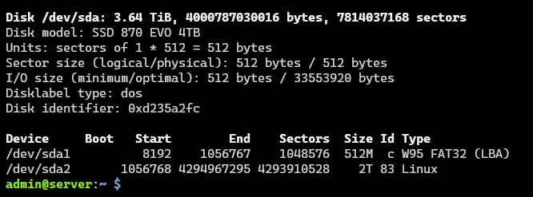
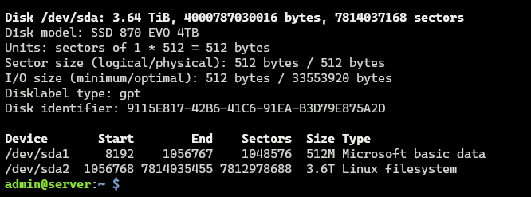
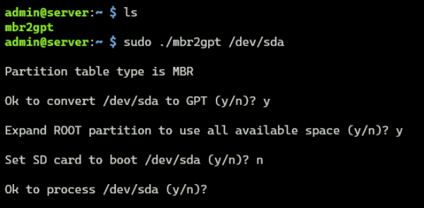

# MBR to GPT Partition Tables

Since the Raspberry Pi imager makes an MBR partition. The max size of a partition is limited to 2TB. This won't use the full capacity on a drive above 2TB in one neat partition. Using a community script, we can change this MBR partition into a GPT partition.

**Before:**

**After:**

This Work around was used to achieve this on my own server.

### Converting MBR to GPT Partition Tables

1. After flashing the primary drive, redo [steps 1-6](/docs/1_Raspberry%20Pi%20OS%20Image%20Configuration.md) again, but on a separate micro-SD card.

2. Without the micro-SD card inserted, just plug in the primary drive, and boot the pi.

3. Wait a couple of minutes for the initial setup to automatically complete on the Primary drive.

4. SSH into the pi with the credentials you set in the imager.

5. Once you are SSH in, `sudo shutdown -h now`

6. Unplug the Primary drive, insert micro-SD card, and Boot to the pi.

7. Wait again for that initial setup to automatically complete on the micro-SD card.

> [!CAUTION]
> 8. Read The first and last few posts [here](https://forums.raspberrypi.com/viewtopic.php?t=196778) on this thread. **The very first post containing the instructions is actively maintained and should take precedence over the following instructions presented below.**

9. Once you are SSH in, plug in the large drive. It should be inserted in the bottom blue USB port.

10. Back on the [thread](https://forums.raspberrypi.com/viewtopic.php?t=196778) you will see the attachment named `usb-boot.zip`. Download and extract the contents.

11. Find the file called `mbr2gpt`. Open it up using Notepad. <kbd>CTRL+a</kbd> and <kbd>CTRL+c</kbd>. **Make sure everything is copied.**

12. In the SSH session, run `nano mbr2gpt`, paste, and save using <kbd>CTRL+X</kbd> <kbd>Y</kbd> <kbd>ENTER</kbd>.

13. Make the script executable by running `sudo chmod +x ./mbr2gpt`

14. Run `sudo ./mbr2gpt /dev/sda`.

15. Here are the settings I used. Set them according to your setup.

    

16. Shutdown by using `sudo shutdown -h now`, remove the sd-card, and boot again.

 Once you SSH back in, most storage is now accessible. The rest is reserved in root, which on a large drive can be many gigabtyes. You can reclaim that too by [Lowering reserved space for root](../2_OS%20Configuration.md).

 You should also [enable trim](../2_OS%20Configuration.md).
